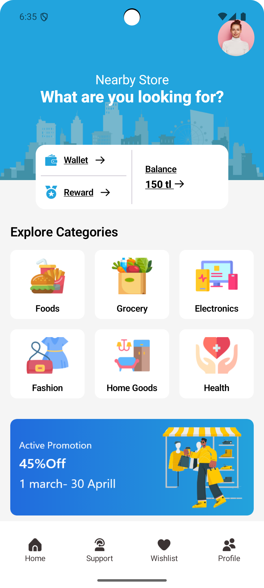
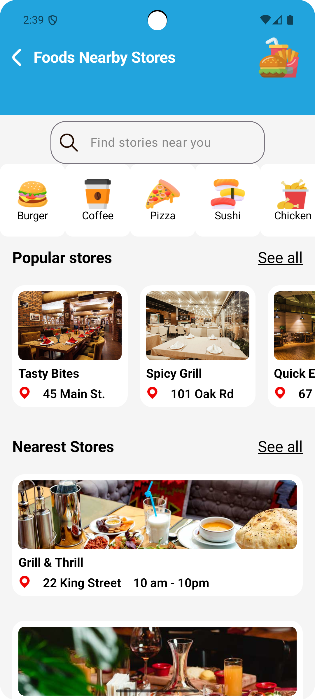

# Nearby Store

Nearby Store, kullanıcıların yakınlarındaki mağazaları keşfetmelerini ve incelemelerini sağlayan, Jetpack Compose ile geliştirilmiş modern bir Android uygulamasıdır. Uygulama, kategorileri gezme, popüler mağazaları görüntüleme ve en yakın konumları bulma konusunda sorunsuz bir deneyim sunar.

## Özellikler

- 🏪 **Kategori Gezinme**: Sezgisel grid düzeni ile farklı mağaza kategorilerini keşfedin
- 🔥 **Popüler Mağazalar**: Bölgenizdeki trend ve popüler mağazaları görüntüleyin
- 📍 **En Yakın Mağazalar**: Konumunuza en yakın mağazaları bulun
- 🔍 **Arama Özelliği**: Belirli mağaza veya kategorileri arayın
- 🎯 **Kullanıcı Dostu Arayüz**: Akıcı animasyonlarla modern Material Design 3 arayüzü
- 📱 **Duyarlı Tasarım**: Çeşitli ekran boyutları için optimize edilmiş

## Teknik Altyapı

- **Programlama Dili**: Kotlin
- **UI Framework**: Jetpack Compose
- **Mimari**: MVVM (Model-View-ViewModel)
- **Veritabanı**: Firebase Realtime Database
- **Resim Yükleme**: Coil
- **Durum Yönetimi**: Compose State

## Ekran Görüntüleri




## Proje Yapısı

```
app/
├── src/
│   ├── main/
│   │   ├── java/
│   │   │   └── com/
│   │   │       └── example/
│   │   │           └── nearby_store/
│   │   │               ├── Activites/
│   │   │               │   ├── Dashboard/
│   │   │               │   └── Result/
│   │   │               ├── Domain/
│   │   │               ├── Repository/
│   │   │               └── ViewModel/
│   │   └── res/
│   │       ├── drawable/
│   │       ├── layout/
│   │       └── values/
└── build.gradle
```

## Kurulum Talimatları

1. Projeyi klonlayın:
```bash
git clone https://github.com/erayclk/nearby_store.git
```

2. Projeyi Android Studio'da açın

3. Firebase'i yapılandırın:
   - Yeni bir Firebase projesi oluşturun
   - Android uygulamanızı Firebase projesine ekleyin
   - `google-services.json` dosyasını indirip app dizinine ekleyin

4. Projeyi derleyin ve çalıştırın

## Bağımlılıklar

- Jetpack Compose
- Firebase Realtime Database
- Coil (resim yükleme için)
- Material Design 3 bileşenleri

## Katkıda Bulunma

Katkılarınızı bekliyoruz! Lütfen Pull Request göndermekten çekinmeyin.

## Lisans

Bu proje MIT Lisansı altında lisanslanmıştır - detaylar için LICENSE dosyasına bakın.

## İletişim

Sorularınız veya önerileriniz için lütfen repository'de bir issue açın. 
